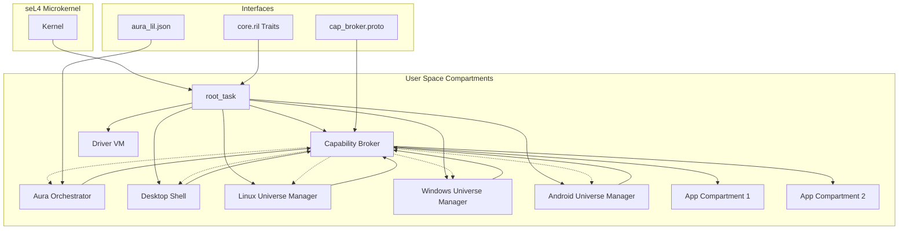
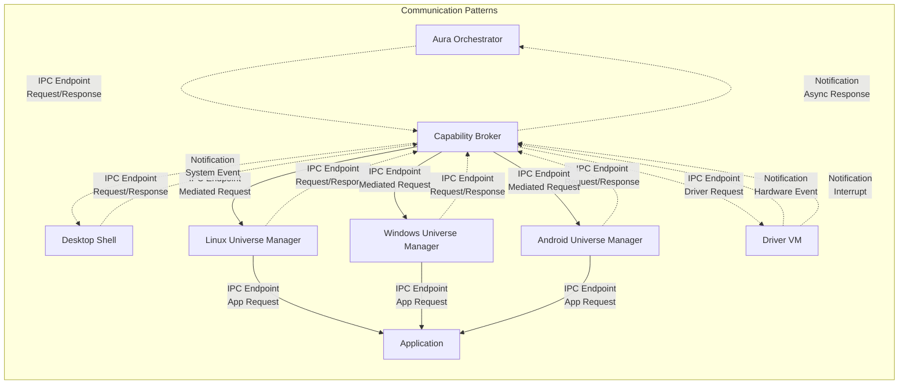

# Loop OS Component Interaction Architecture

This document describes the complete architecture of Loop OS, detailing how all components interact through the seL4 microkernel and the Capability Broker system. It serves as the implementation guide for AI coding agents building the operating system.

## High-Level Architecture Overview



## 1. Compartment Inventory

### 1.1 root_task
- **Initial seL4 Capabilities**: 
  - `Cap<CNode>` - Root CSpace with all boot capabilities
  - `Cap<PageDirectory>` - Initial VSpace with kernel mappings
  - `Cap<TCB>` - Root task's own TCB
  - `Cap<UntypedMemory>[]` - All untyped memory regions from BootInfo
  - `Cap<IRQControl>` - Full IRQ control capability
  - `Cap<ASIDPool>` - Address space ID pool
- **Loop Capabilities**: None (root task only creates other compartments)
- **Responsibilities**:
  - Retype untyped memory to create initial compartments
  - Set up IPC endpoints and distribute capabilities
  - Launch Capability Broker with orchestrate token
  - Launch Driver VM and universe managers
  - Configure initial security policies

### 1.2 Capability Broker (cap_broker)
- **Initial seL4 Capabilities**:
  - `Cap<CNode>` - Own CSpace
  - `Cap<PageDirectory>` - Own VSpace
  - `Cap<TCB>` - Own TCB
  - `Cap<Endpoint>` - IPC endpoint for client communication
  - `Cap<Notification>` - Notification for async operations
- **Loop Capabilities**:
  - `OrchestrateResource` with `can_chain = true` (initial token)
  - All capability management rights (create, revoke, delegate, inspect)
- **Responsibilities**:
  - Manage all user-level capability tokens
  - Mediate all inter-compartment resource access
  - Verify Aura's capability declarations before executing intents
  - Enforce delegation policies
  - Provide capability inspection for debugging

### 1.3 Aura Orchestrator (aura_orchestrator)
- **Initial seL4 Capabilities**:
  - `Cap<CNode>` - Own CSpace
  - `Cap<PageDirectory>` - Own VSpace
  - `Cap<TCB>` - Own TCB
  - `Cap<Endpoint>` - IPC endpoint to Capability Broker
  - `Cap<Notification>` - Notification for async responses
- **Loop Capabilities**:
  - `OrchestrateResource` with `can_chain = true` (delegated from broker)
  - Basic `app:launch` capabilities for all universes
  - `fs:read` for system configuration files
  - `net:outbound` for web searches
- **Responsibilities**:
  - Parse natural language user requests
  - Decompose requests into LIL intents
  - Declare required capabilities to broker
  - Chain multiple capabilities for complex tasks
  - Handle user confirmation for sensitive actions

### 1.4 Desktop Shell (desktop_shell)
- **Initial seL4 Capabilities**:
  - `Cap<CNode>` - Own CSpace
  - `Cap<PageDirectory>` - Own VSpace
  - `Cap<TCB>` - Own TCB
  - `Cap<Endpoint>` - IPC endpoint to Capability Broker
  - `Cap<Notification>` - Notification for system events
- **Loop Capabilities**:
  - `app:launch` for all universes
  - `fs:read` for desktop configuration
  - `device:speaker` for audio feedback
  - `clipboard:read` and `clipboard:write`
- **Responsibilities**:
  - Provide user interface for system interaction
  - Display application launcher
  - Handle user input and system notifications
  - Manage desktop environment settings

### 1.5 Linux Universe Manager (linux_universe_mgr)
- **Initial seL4 Capabilities**:
  - `Cap<CNode>` - Own CSpace
  - `Cap<PageDirectory>` - Own VSpace
  - `Cap<TCB>` - Own TCB
  - `Cap<Endpoint>` - IPC endpoint to Capability Broker
- **Loop Capabilities**:
  - `app:launch` for Linux applications
  - `fs:read` and `fs:write` for Linux app data
  - `net:outbound` and `net:inbound` for Linux networking
  - `device:camera`, `device:microphone`, `device:speaker`
- **Responsibilities**:
  - Manage Linux application sandboxes
  - Translate Loop capabilities to Linux permissions
  - Handle Linux-specific IPC and file system operations
  - Provide Linux compatibility layer

### 1.6 Windows Universe Manager (windows_universe_mgr)
- **Initial seL4 Capabilities**:
  - `Cap<CNode>` - Own CSpace
  - `Cap<PageDirectory>` - Own VSpace
  - `Cap<TCB>` - Own TCB
  - `Cap<Endpoint>` - IPC endpoint to Capability Broker
- **Loop Capabilities**:
  - `app:launch` for Windows applications
  - `fs:read` and `fs:write` for Windows app data
  - `net:outbound` and `net:inbound` for Windows networking
  - `device:camera`, `device:microphone`, `device:speaker`
- **Responsibilities**:
  - Manage Windows application sandboxes
  - Translate Loop capabilities to Windows permissions
  - Handle Windows-specific IPC and registry operations
  - Provide Windows compatibility layer

### 1.7 Android Universe Manager (android_universe_mgr)
- **Initial seL4 Capabilities**:
  - `Cap<CNode>` - Own CSpace
  - `Cap<PageDirectory>` - Own VSpace
  - `Cap<TCB>` - Own TCB
  - `Cap<Endpoint>` - IPC endpoint to Capability Broker
- **Loop Capabilities**:
  - `app:launch` for Android applications
  - `fs:read` and `fs:write` for Android app data
  - `net:outbound` and `net:inbound` for Android networking
  - `device:camera`, `device:microphone`, `device:speaker`
  - `contacts:read` and `contacts:write`
  - `location:precise` and `location:coarse`
- **Responsibilities**:
  - Manage Android application sandboxes
  - Translate Loop capabilities to Android permissions
  - Handle Android-specific IPC and content providers
  - Provide Android compatibility layer

### 1.8 Driver VM (driver_vm)
- **Initial seL4 Capabilities**:
  - `Cap<CNode>` - Own CSpace
  - `Cap<PageDirectory>` - Own VSpace
  - `Cap<TCB>` - Own TCB
  - `Cap<IRQControl>` - Limited IRQ control for assigned devices
  - `Cap<Endpoint>` - IPC endpoint to Capability Broker
- **Loop Capabilities**: None (driver VM is fully isolated)
- **Responsibilities**:
  - Handle device drivers in isolated environment
  - Provide hardware abstraction to other compartments
  - Manage interrupt handling and device I/O
  - Maintain hardware security boundaries

### 1.9 Application Compartments (app_compartments)
- **Initial seL4 Capabilities**:
  - `Cap<CNode>` - Own CSpace (minimal)
  - `Cap<PageDirectory>` - Own VSpace (minimal)
  - `Cap<TCB>` - Own TCB
  - `Cap<Endpoint>` - IPC endpoint to universe manager
- **Loop Capabilities**: None initially (granted per-request by broker)
- **Responsibilities**:
  - Execute application code in sandboxed environment
  - Receive mediated capability access from broker
  - Communicate only through universe manager

## 2. Boot Sequence

### 2.1 Kernel Initialization
1. seL4 kernel loads and sets up initial hardware state
2. Kernel creates initial `root_task` with boot capabilities
3. `root_task` receives `BootInfo` with untyped memory regions

### 2.2 Root Task Setup
```rust
// Pseudo-code using core.ril traits
fn root_task_main() {
    let boot_info = seL4_BootInfo::get();
    let syscalls = SystemCallImpl::new();
    
    // 1. Create Capability Broker compartment
    let broker_cnode = syscalls.cap_ops().retype(
        &boot_info.untyped_regions[0], 
        &mut Cap::<CNode>::new(), 
        CNode::SEL4_TYPE, 
        12 // 2^12 slots
    )?;
    
    let broker_vspace = syscalls.cap_ops().retype(
        &boot_info.untyped_regions[0], 
        &mut Cap::<PageDirectory>::new(), 
        PageDirectory::SEL4_TYPE, 
        12
    )?;
    
    let broker_tcb = syscalls.cap_ops().retype(
        &boot_info.untyped_regions[0], 
        &mut Cap::<TCB>::new(), 
        TCB::SEL4_TYPE, 
        9
    )?;
    
    // 2. Create IPC endpoints
    let broker_endpoint = syscalls.cap_ops().retype(
        &boot_info.untyped_regions[0], 
        &mut Cap::<Endpoint>::new(), 
        Endpoint::SEL4_TYPE, 
        4
    )?;
    
    // 3. Configure and launch Capability Broker
    syscalls.thread_ops().configure(
        &broker_tcb, 
        &broker_cnode, 
        &broker_vspace, 
        VirtAddr(0x1000000), 
        VirtAddr(0x2000000)
    )?;
    
    // 4. Delegate orchestrate capability to broker
    let orchestrate_token = create_orchestrate_token(&syscalls)?;
    
    // 5. Start broker
    syscalls.thread_ops().resume(&broker_tcb)?;
    
    // 6. Create other compartments (similar pattern)
    create_driver_vm(&boot_info, &syscalls)?;
    create_universe_managers(&boot_info, &syscalls)?;
    create_desktop_shell(&boot_info, &syscalls)?;
}
```

### 2.3 Capability Broker Initialization
1. Broker starts with orchestrate token
2. Sets up IPC endpoint for client communication
3. Registers with root task for capability management
4. Initializes capability database
5. Prepares to receive capability requests

### 2.4 Universe Managers Launch
1. Each universe manager is created with minimal capabilities
2. Requests basic app launch capabilities from broker
3. Sets up compatibility layer for target OS
4. Registers with broker for app mediation

### 2.5 Desktop Shell and Aura Launch
1. Desktop shell launches and requests UI capabilities
2. Aura orchestrator launches with orchestrate token
3. Both establish IPC channels to broker
4. System ready for user interaction

## 3. Intent Execution Flow: "Send Email" Scenario

### 3.1 User Request
*"Find that PDF I downloaded last Tuesday about GPU benchmarks, take the summary paragraph, put it in a new email to Mark, and schedule the email to send tomorrow at 9am."*

### 3.2 Aura Intent Decomposition
Aura breaks this into sequential LIL intents:

```json
// Intent 1: Search for PDF
{
  "intent": "search",
  "params": {
    "query": "GPU benchmarks PDF",
    "scope": "downloads",
    "time_filter": "last Tuesday",
    "file_type": "pdf"
  },
  "required_capabilities": [
    {"type": "fs:read", "identifier": "/home/user/Downloads"},
    {"type": "fs:read", "identifier": "/home/user/Documents"}
  ],
  "confirmation_required": false
}

// Intent 2: Read PDF content
{
  "intent": "open",
  "params": {
    "target": "/home/user/Downloads/gpu_benchmarks.pdf",
    "operation": "read_summary"
  },
  "required_capabilities": [
    {"type": "fs:read", "identifier": "/home/user/Downloads/gpu_benchmarks.pdf"}
  ],
  "confirmation_required": false
}

// Intent 3: Create email
{
  "intent": "compose",
  "params": {
    "type": "email",
    "to": ["mark@example.com"],
    "subject": "GPU Benchmarks Summary",
    "body": "[extracted summary paragraph]",
    "schedule": "tomorrow 9:00am"
  },
  "required_capabilities": [
    {"type": "contacts:read", "identifier": "all"},
    {"type": "net:outbound", "identifier": "smtp.gmail.com"},
    {"type": "calendar:write", "identifier": "personal"}
  ],
  "confirmation_required": true
}
```

### 3.3 Capability Broker Mediation

#### Step 1: Search Intent Processing
```rust
// Broker receives intent via IPC endpoint
let message = broker.endpoint_ops().receive(&broker_endpoint, &mut msg)?;
let intent: LILIntent = serde_json::from_slice(&msg.data)?;

// Verify Aura holds required capabilities
for req_cap in &intent.required_capabilities {
    if !broker.verify_capability_held(&aura_compartment, req_cap) {
        return Err(CapError::InsufficientRights);
    }
}

// Mediate filesystem search
let search_result = broker.mediate_filesystem_search(
    &intent.params.query,
    &intent.params.scope,
    &aura_compartment
)?;

// Send result back to Aura
broker.endpoint_ops().send(&broker_endpoint, response_message)?;
```

#### Step 2: PDF Content Extraction
```rust
// Verify Aura has read access to specific file
if !broker.verify_capability_held(&aura_compartment, 
    &CapRequest { type: "fs:read", identifier: "/home/user/Downloads/gpu_benchmarks.pdf" }) {
    return Err(CapError::InsufficientRights);
}

// Create temporary capability for file access
let temp_cap = broker.create_temporary_capability(
    FilesystemResource {
        path: "/home/user/Downloads/gpu_benchmarks.pdf".to_string(),
        read: true,
        write: false,
        execute: false,
        delegatable: false
    },
    &aura_compartment
)?;

// Mediate file read through Linux Universe Manager
let content = broker.linux_universe_mgr.read_file(&temp_cap)?;

// Clean up temporary capability
broker.cap_ops().delete(temp_cap)?;
```

#### Step 3: Email Composition and Scheduling
```rust
// This requires confirmation due to sensitive nature
if intent.confirmation_required {
    let confirmation = broker.request_user_confirmation(
        "Send email to Mark with GPU benchmarks summary?",
        &["Send Now", "Cancel", "Edit"]
    )?;
    
    if confirmation != "Send Now" {
        return Err(UserError::Cancelled);
    }
}

// Verify all required capabilities
broker.verify_capabilities_held(&aura_compartment, &intent.required_capabilities)?;

// Create temporary capabilities for this operation
let contacts_cap = broker.create_temporary_capability(
    ContactsResource { read: true, write: false, delegatable: false, filter: "all" },
    &aura_compartment
)?;

let network_cap = broker.create_temporary_capability(
    NetworkResource {
        protocol: TCP,
        domain_filter: "smtp.gmail.com".to_string(),
        port: 587,
        direction: OUTBOUND,
        delegatable: false
    },
    &aura_compartment
)?;

let calendar_cap = broker.create_temporary_capability(
    CalendarResource { read: false, write: true, delegatable: false, calendar_id: "personal" },
    &aura_compartment
)?;

// Execute through appropriate universe managers
let email_id = broker.linux_universe_mgr.send_email(&network_cap, &email_content)?;
broker.android_universe_mgr.schedule_event(&calendar_cap, &email_schedule)?;

// Clean up all temporary capabilities
broker.cap_ops().delete(contacts_cap)?;
broker.cap_ops().delete(network_cap)?;
broker.cap_ops().delete(calendar_cap)?;
```

### 3.4 Security Enforcement Points
1. **Capability Verification**: Broker checks Aura holds every declared capability
2. **Temporary Capability Creation**: Broker creates limited, time-bound capabilities
3. **Universe Manager Mediation**: Actual operations performed through isolated managers
4. **Capability Cleanup**: All temporary capabilities explicitly deleted after use
5. **User Confirmation**: Sensitive operations require explicit user approval

## 4. Inter-Compartment Communication Map



### Communication Protocols

| From | To | Method | Protocol | Purpose |
|------|----|--------|----------|---------|
| Aura | Broker | IPC Endpoint | Request/Response | Intent execution, capability requests |
| Desktop Shell | Broker | IPC Endpoint | Request/Response | App launch, system settings |
| Universe Managers | Broker | IPC Endpoint | Request/Response | Capability mediation |
| Broker | Universe Managers | IPC Endpoint | Request/Response | Mediated operations |
| Universe Managers | Apps | IPC Endpoint | Request/Response | App-specific operations |
| Driver VM | Broker | Notification | One-way signal | Hardware events |
| Broker | Desktop Shell | Notification | One-way signal | System notifications |
| Broker | Aura | Notification | One-way signal | Async responses |

## 5. Security Invariants

### 5.1 Capability Isolation Rules
1. **No Direct Capability Transfer**: Capabilities are never transferred directly between compartments. All transfers go through the Capability Broker.
2. **Temporary Capability Principle**: All delegated capabilities are temporary, scoped, and automatically revoked after use.
3. **Least Privilege Enforcement**: Compartments only receive the minimum capabilities necessary for their function.
4. **Capability Verification**: The broker verifies that Aura holds all declared capabilities before executing any intent.

### 5.2 Memory and Space Isolation
1. **CSpace Isolation**: No compartment can access another's CSpace without explicit capability delegation.
2. **VSpace Isolation**: No compartment can access another's virtual memory without explicit capability delegation.
3. **No Root Access**: There is no privileged user or compartment that can bypass capability checks.
4. **Kernel Boundary**: All cross-compartment communication must go through seL4 kernel objects.

### 5.3 Aura Orchestration Constraints
1. **Orchestrate Token Limits**: Aura's orchestrate token cannot be used to bypass user confirmation for sensitive actions.
2. **Capability Declaration**: Aura must declare ALL capabilities required for an intent before execution.
3. **No Capability Escalation**: Aura cannot grant itself additional capabilities without broker approval.
4. **User Confirmation Required**: Any action that could expose user data or modify system state requires explicit user confirmation.

### 5.4 Driver VM Isolation
1. **Complete Data Isolation**: Driver VM cannot access user data compartments under any circumstances.
2. **Limited IRQ Control**: Driver VM only receives IRQ control for explicitly assigned devices.
3. **No Direct User Communication**: All driver VM communication must go through the Capability Broker.
4. **Hardware Abstraction**: Driver VM provides hardware abstraction but cannot expose raw hardware access.

### 5.5 Application Sandboxing
1. **Universe Manager Mediation**: Applications can only access resources through their universe manager.
2. **No Direct Broker Access**: Applications cannot communicate directly with the Capability Broker.
3. **Scoped Capabilities**: Application capabilities are scoped to their specific data and resources.
4. **Runtime Capability Revocation**: Capabilities can be revoked at any time by the broker.

### 5.6 System Integrity
1. **Boot-Time Security**: The root task establishes all initial security boundaries before launching user compartments.
2. **Capability Auditing**: All capability operations are logged and auditable by the broker.
3. **Compartment Compromise Containment**: Compromise of any compartment cannot affect others due to capability isolation.
4. **Formal Verification Preservation**: All implementations must preserve seL4's formal verification properties.

### 5.7 Network and Device Security
1. **Network Mediation**: All network access must be mediated through the broker with explicit capabilities.
2. **Device Access Control**: Device access requires specific capabilities and is mediated through universe managers.
3. **Location Privacy**: Location access requires explicit user consent and capability delegation.
4. **Contact and Calendar Protection**: Contact and calendar access requires user confirmation and scoped capabilities.

These invariants are non-negotiable and must be enforced by all implementations of the Loop OS system. Any violation could compromise the system's security model and user privacy protections.
